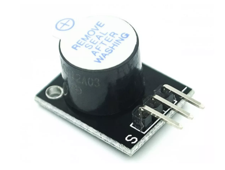
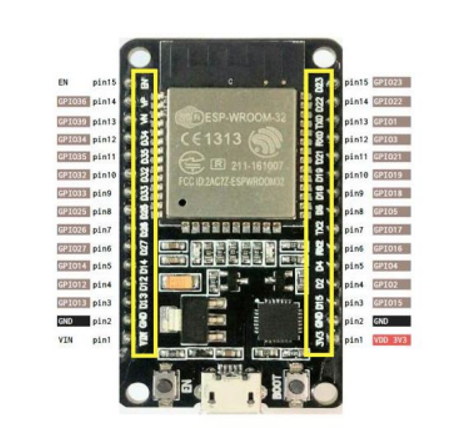
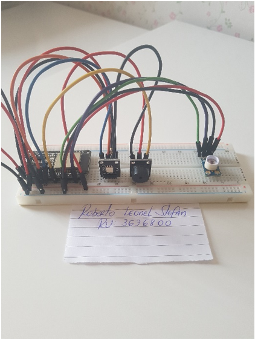

# Smart Fever Detection and Medical Triage System (ESP32)

---

# Automated Fever Detection and Medical Triage System

## Overview

This project presents the development of an **embedded medical triage prototype** designed to accelerate patient screening in healthcare environments such as hospitals and public health units.

The system was developed using an **ESP32 microcontroller** and an **MLX90614 infrared temperature sensor** to perform **non-contact body temperature measurement**.

The system simulates a **health triage process similar to the Brazilian Unified Health System (SUS)**, prioritizing patients with fever or critical temperature levels.

Visual and auditory feedback is provided using an **RGB LED module** and a **buzzer alarm**.

---

# Important Observation

Temperature measurement is performed **on the patient's index finger** using the **MLX90614 infrared sensor**.

To improve measurement reliability, the system performs:

• **Three consecutive temperature readings**  
• **Calculates the average value**

This method significantly **reduces measurement noise and improves accuracy**.

Because the measurement is **non-contact and automated**, the system enables **much faster screening in waiting lines**, allowing healthcare personnel to quickly identify patients requiring urgent medical attention.

---

# Demonstration Video / Vídeo de Demonstração

Watch the system operating in the video below:

Assista ao sistema em funcionamento no vídeo abaixo:

https://www.youtube.com/watch?v=-At-b64NuDQ&t=55s

---

# System Architecture

Patient
│
▼
Index Finger Temperature Measurement
│
▼
MLX90614 Infrared Sensor
│
▼
ESP32 Microcontroller
│
├── Temperature Reading (3 measurements)
│
├── Average Temperature Calculation
│
├── Fever Classification Algorithm
│
├── SUS Patient Identification
│
├── Triage Queue Simulation
│
├── RGB LED Status Indicator
│
└── Buzzer Critical Alert

---

# Hardware Components

| Component | Description |
|--------|--------|
| ESP32 | Main microcontroller responsible for system processing |
| MLX90614 | Infrared temperature sensor |
| KY-009 RGB LED | Visual status indicator |
| KY-006 Passive Buzzer | Audible alert for critical cases |
| Breadboard | Circuit prototyping |
| Jumper wires | Electrical connections |
| USB Power Supply | System power |

---

# ESP32 Pinout

| Device | ESP32 Pin |
|------|------|
| MLX90614 SDA | GPIO 21 |
| MLX90614 SCL | GPIO 22 |
| RGB LED Red | GPIO 25 |
| RGB LED Green | GPIO 26 |
| RGB LED Blue | GPIO 27 |
| Buzzer | GPIO 14 |

*(Pins may be adjusted depending on implementation)*

---

# Temperature Classification

The system uses the **average of three readings** to determine the patient's health condition.

| Temperature | Condition | System Response |
|-------------|-----------|----------------|
| < 37.5°C | Normal | Green LED |
| 37.5°C – 38.9°C | Fever | Yellow LED |
| ≥ 39°C | High Fever | Red LED + Buzzer |

---

# Firmware Description

The firmware was developed using the **Arduino IDE for ESP32**.

Main functions include:

• Sensor communication via **I2C**  
• Temperature acquisition  
• Average calculation  
• Fever classification  
• Queue simulation  
• LED and buzzer control  

---

# Project Directory Structure

fever-triage-system
│
├── firmware
│ └── esp32_fever_detection.ino
│
├── hardware
│ └── circuit_diagram.png
│
├── images
│ ├── prototype.jpg
│ ├── circuit.jpg
│ └── demo.jpg
│
├── docs
│ └── academic_report.pdf
│
└── README.md

---

These images show the experimental hardware setup used during development.

Essas imagens mostram o protótipo utilizado durante o desenvolvimento.
## Prototype Screens

  
  
  

  
  
  

  

---

# Applications

This system may be adapted for:

• Hospital triage automation  
• Public health screening stations  
• Epidemic monitoring systems  
• Smart medical IoT devices  
• Patient prioritization systems  

---

# Future Improvements

Possible upgrades include:

• LCD display interface  
• WiFi data logging  
• Cloud patient database  
• AI assisted triage classification  
• Integration with hospital management systems  

---

# Academic Context

This project was developed as part of an **engineering academic program**, focusing on the application of **embedded systems for healthcare technology**.

Fields involved:

• Embedded Systems  
• Microcontrollers  
• Biomedical Instrumentation  
• Electronic Circuit Design  
• Healthcare Automation  

---

# Author

Roberto Leonel Stefan  
Electrical Engineering Student

---

# Portuguese Version

---

# Sistema Inteligente de Detecção de Febre e Triagem Médica (ESP32)

## Visão Geral

Este projeto apresenta o desenvolvimento de um **protótipo de triagem médica automatizada**, projetado para acelerar o processo de identificação de pacientes com febre em ambientes hospitalares e unidades de saúde.

O sistema utiliza um **microcontrolador ESP32** e um **sensor infravermelho MLX90614** para realizar **medições de temperatura corporal sem contato físico**.

O objetivo do sistema é **simular um processo de triagem semelhante ao utilizado no Sistema Único de Saúde (SUS)**, priorizando pacientes com temperaturas elevadas.

O sistema utiliza:

• **LED RGB para indicação visual**  
• **Buzzer para alerta sonoro em casos críticos**

---

# Observação Importante

A medição de temperatura é realizada **no dedo indicador do paciente** utilizando o sensor infravermelho **MLX90614**.

Para aumentar a confiabilidade da medição, o sistema realiza:

• **Três leituras consecutivas de temperatura**  
• **Cálculo da média das leituras**

Este método reduz erros de medição e melhora a precisão do sistema.

Como a medição é **rápida e sem contato**, o sistema permite realizar **triagens muito mais rápidas em filas de espera**, auxiliando profissionais de saúde a identificar rapidamente pacientes com possíveis quadros febris.

---

# Componentes de Hardware

| Componente | Descrição |
|--------|--------|
| ESP32 | Microcontrolador principal |
| MLX90614 | Sensor infravermelho de temperatura |
| LED RGB KY-009 | Indicador visual |
| Buzzer Passivo KY-006 | Alerta sonoro |
| Protoboard | Montagem do circuito |
| Jumpers | Conexões elétricas |

---

# Classificação de Temperatura

| Temperatura | Condição | Resposta |
|-------------|-----------|----------|
| < 37.5°C | Normal | LED Verde |
| 37.5°C – 38.9°C | Febre | LED Amarelo |
| ≥ 39°C | Febre Alta | LED Vermelho + Buzzer |

---

# Estrutura do Projeto

/firmware
/hardware
/images
/docs
README.md

---

# Autor

Roberto Leonel Stefan  
Estudante de Engenharia Elétrica
